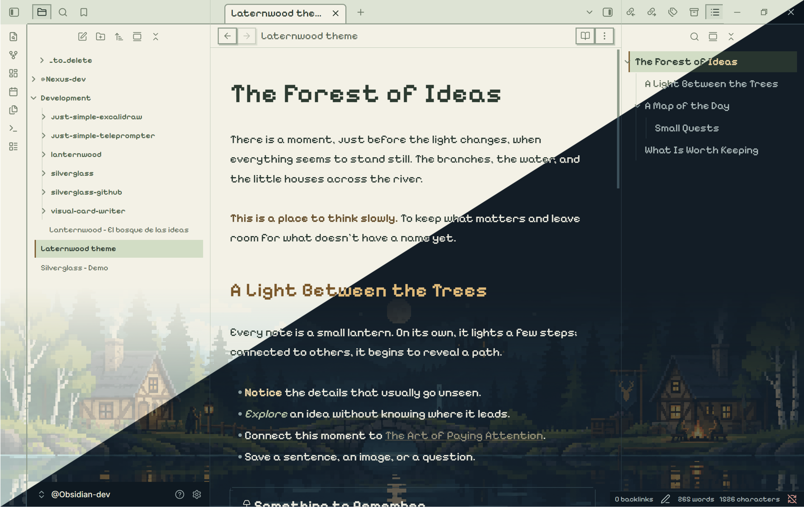
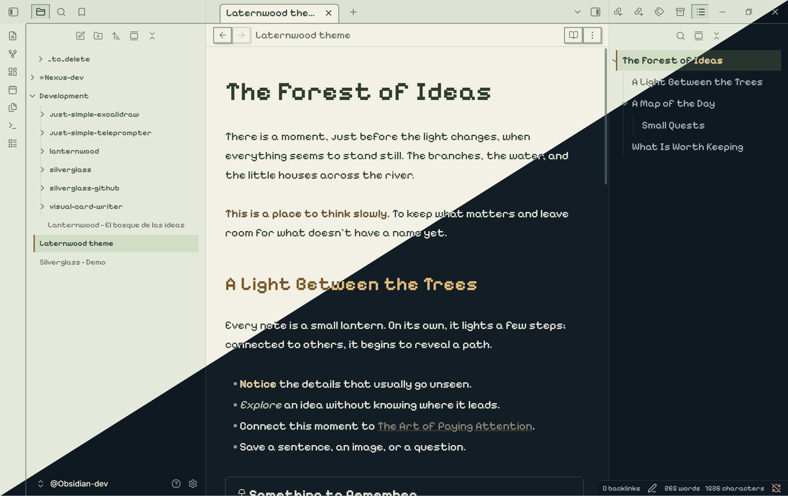
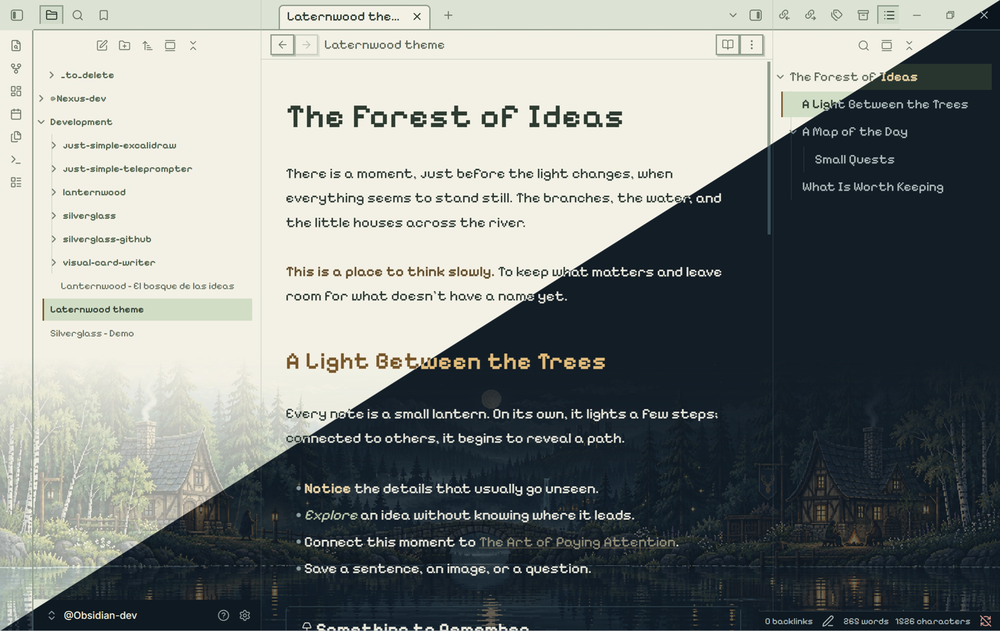

# Lanternwood

A highly customizable pixel-art Obsidian theme with **10 configuration options**
for landscapes, typography, reading width and icons through Style Settings.
Warm lanterns, forest greens and stepped details create a quiet place to write.
Version **0.2.2**. Original theme by David Hurtado.

Inspired by the atmosphere of **Kingdom Two Crowns**, with original scenery and
no extracted game assets. Choose a simple pixel interface, a chunky classic
forest, or a more detailed landscape — all in light and dark mode.

[Download the latest release](https://github.com/DavidHurtadoAI/lanternwood/releases/latest)
· [Configuration](#style-settings) · [Typography](#typography)

## Six looks, one theme

The opening screenshot shows **Classic forest**, with larger pixel clusters and
simpler silhouettes. Light mode is on the upper-left side of each comparison;
dark mode is on the lower-right. These are user-supplied captures of Obsidian.

### Pixel interface, no forest



Turn **Enable forest** off for a clean background. The pixel typography,
square controls and theme colors remain.

### Detailed forest



Enable the forest and select **Detailed — more detail** for finer textures.
For the chunky artwork shown at the top, select **Classic pixel — less detail**.
These three backgrounds × two color schemes make the six looks shown here.

All three screenshots use optional pixel note text. On a fresh install, note
paragraphs keep your reading font and the forest is off.

## Install

1. Download [Lanternwood-0.2.2.zip](https://github.com/DavidHurtadoAI/lanternwood/releases/download/0.2.2/Lanternwood-0.2.2.zip) from the release. Extract and copy its `Lanternwood` folder into your vault's
   `.obsidian/themes/` directory. It contains `manifest.json` and `theme.css`.
2. Select **Lanternwood** under **Settings → Appearance → Themes**.
3. Install and enable **Style Settings** if you want to customize the theme.
4. Open **Settings → Style Settings → Lanternwood → Forest → Enable forest**.

Alternatively, download `manifest.json` and `theme.css` from the same release
and place both in `.obsidian/themes/Lanternwood/`. Requires Obsidian **1.14.2
or later**. This theme is not yet listed in the Community Themes directory.
To update, replace those two files with the files from the newer release.

The forest is off by default in a fresh install. The pixel theme works without
Style Settings. Font, original glyphs and all four landscapes are embedded in CSS:
no external asset folders, internet connection, font installation or API key
are needed at runtime. The complete CSS is about 0.96 MB (938 KiB). The four landscapes use compressed
WebP at their original 2172×724 dimensions; the original PNGs remain in the repository.
WebP compression is lossy. The build is checked against a 1 MB project budget.

## Day and night

Choose **Landscape style** in Style Settings:

- **Classic pixel — less detail** (default): large pixel clusters, simpler silhouettes,
  fewer fine textures and broader reflections, guided by the supplied Kingdom Two Crowns reference.
- **Detailed — more detail**: the original finer-textured forest artwork.

Each style has its own matching day/night pair. This selection changes the artwork,
not the typography, opacity, forest height or editor layout.

**Dark mode:** midnight blue, sage green and amber, with illuminated cottages
and a moonlit forest. **Light mode:** pale parchment, moss green and warm brown,
with the corresponding daytime landscape. The correct image follows Obsidian's
light/dark setting automatically.

The forest sits **behind the workspace**, with adjustable transparency and a
soft vertical fade. It never reserves space or intercepts clicks: notes retain
the full editor height with the forest on or off. Menus and toolbars retain
their surfaces. The panorama preserves its proportions and crops to fit; its
visible area changes with the window size and chosen background height. It is static.

## Style Settings

Open **Settings → Style Settings → Lanternwood**. There are **10 controls in
two groups**. All option labels and descriptions are in English, regardless of
Obsidian's interface language. Changes apply immediately.

**The tables give fresh-install defaults.** Your saved preferences can differ.
Use the reset arrow next to a modified control to return it to its default.

### Forest

| Control | Default | Available values | What it does |
| --- | --- | --- | --- |
| **Enable forest** | Off | On / Off | Shows the landscape behind the editor and sidebars. Also adds a forest toggle to the command palette. Disabling it leaves the rest of the pixel theme active. |
| **Landscape style** | Classic pixel — less detail | Classic pixel — less detail / Detailed — more detail | Chooses simpler shapes and larger pixel clusters, or the finer-textured original artwork. Both include matching day and night images. Only the scenery changes. |
| **Background height** | 360 px | 100–600 px, in steps of 10 | Sets how far the backdrop rises from the bottom of the workspace. Its top fades into the background. This does not reserve space or shorten the editor. |
| **Forest opacity** | 0.4 | 0.1–0.8, in steps of 0.05 | Controls transparency: lower values blend the scenery more gently into the workspace; higher values make it more visible behind the text. |
| **Forest brightness** | 1 | 0.5–1.2, in steps of 0.05 | Adjusts the image's brightness: 1 keeps the original brightness, values below 1 darken it and values above 1 brighten it. |

**Opacity and brightness are independent.** Lower opacity for a quieter reading
background; lower brightness when the image itself feels too bright. Height,
style, opacity and brightness become visible when the forest is enabled.

The actual height is limited to **75% of the viewport on desktop**, **65% in
windows up to 800 px wide**, and **60% in mobile mode**. The image keeps its
proportions and may crop as the window changes size. A tall, opaque forest
deliberately reaches farther behind the note, reducing contrast near the bottom.
Light and dark modes use the same control values, with different artwork.

### Typography and reading

| Control | Default | Available values | What it does |
| --- | --- | --- | --- |
| **Use reading font for headings** | Off | On / Off | Replaces the pixel heading font with the reading font. Applies to note headings, the inline title and callout titles. Leave off for pixel headings. |
| **Use regular interface font for navigation** | Off | On / Off | Uses your regular interface font for the file explorer, outline, view-header title, settings labels, buttons and dropdowns. Leave off for pixel navigation. |
| **Use pixel font for note text** | Off | On / Off | Uses Pixelify Sans for note text in editing and reading views, with a 19 px base size. When off, paragraphs use your Obsidian reading font. |
| **Reading width** | 760 px | 520–1000 px, in steps of 20 | Sets the target readable line width. Requires Obsidian's **Settings → Editor → Readable line length** to be enabled; the available pane width still limits it. |
| **Use native Obsidian icons** | Off | On / Off | Restores native icons in place of the theme's 16 custom pixel glyph designs and their aliases. Icons outside that custom set already retain their native appearance. |

The font switches have specific scopes: tabs, the title bar, status bar, modal
titles and frontmatter properties retain their pixel styling. Property names
have no decorative border. The native-icon switch changes glyphs, independently
of fonts and scenery.

For your configured reading font throughout a note, turn **Use reading font for headings** on and **Use pixel font for note text** off.

### Settings provided by Obsidian

The **light/dark color scheme**, your **text font**, **interface font**,
**monospace font** and regular **font size** are configured in Obsidian's
**Appearance** settings. Lanternwood uses those preferences where it does not
explicitly apply pixel typography. The pixel-note-text option sets its own
19 px base size. **Readable line length** is an Obsidian Editor setting;
Lanternwood's width slider works with it.

There is no separate day/night switch, animation control or independent sidebar
forest toggle: the landscape follows the color scheme and spans the workspace.

## Typography

The pixel typeface is **Pixelify Sans**, by **The Pixelify Sans Project Authors**.
The bundled file is a **variable TrueType font with weights 400–700**, embedded
directly in the theme CSS. Its internal CSS family name, `Lanternwood Pixel`,
is an alias for Pixelify Sans, not a different typeface. You do not need to
install it, and it loads without a network connection.

| Area | Font used |
| --- | --- |
| Headings, inline title and callout titles | Pixelify Sans by default; the heading switch selects the reading font. |
| Navigation and controls | Pixelify Sans by default; the navigation switch selects the regular interface font in the areas listed above. |
| Tabs, title/status bars, modal titles and frontmatter properties | Pixelify Sans, including property names and values. |
| Note paragraphs | Your Obsidian text font; the theme fallback is Segoe UI, then the system sans-serif. Pixelify Sans is optional through the pixel-note-text switch. |
| Code | Your Obsidian monospace font; the theme fallback is Cascadia Code, then Consolas, then the system monospace. These fallback fonts are not bundled. |

Pixelify Sans is distributed under the **SIL Open Font License 1.1**, separately
from the theme's MIT license. See the [bundled font license](assets/OFL-PixelifySans.txt)
for its copyright notice and terms. The scenery and the custom SVG icons are
separate artwork; they are not characters from this font.

## Markdown

Standard headings, tasks, links, tables, code, tags, quotes, properties and
callouts are styled. Two optional callouts add a lantern or woodland accent:

```md
> [!lantern] Something to remember
> Leave room for new ideas.

> [!forest] A forest of connections
> Good notes open new paths.
```

`[!remember]` is an alias for the lantern callout.

## Development

Requires Node.js and npm. No build step is needed for users installing the ZIP.

```sh
npm ci --ignore-scripts
npm run build
npm run lint
npm run check
```

`npm run optimize:assets` regenerates the bundled WebP images from the original
PNGs using Sharp (quality 75, no resizing). The generated WebP files are committed,
so ordinary builds do not need to recompress them.

`src/theme.css` is the editable CSS. `scripts/build.mjs` embeds the font,
day/night WebP images, font license and original 16×16 SVG glyphs into `theme.css`.
`npm run install:dev` is a local maintainer helper: it assumes the repository
is at `<vault>/Development/lanternwood` and installs two levels above the
repository. Do not use that helper from an arbitrary clone location. `scripts/check.mjs` checks CSS, YAML settings, version synchronization,
asset completeness and offline packaging. `scripts/ui-qa.mjs` uses the Obsidian
CLI against `@Obsidian-dev`, temporarily changes appearance settings and restores
them; it never modifies note content.

See [VALIDATION.md](VALIDATION.md) for actual coverage and limitations.

## License

Lanternwood is released under the **[MIT License](LICENSE)**.
Copyright © 2026 David Hurtado.

You may use, copy, modify and distribute the theme, including for commercial
purposes, provided you retain the copyright and license notice. The theme is
provided "as is", without warranty. See the full license for its terms.

The bundled **Pixelify Sans** font has its own **SIL Open Font License 1.1**;
it is not covered by the theme's MIT license. Its copyright and complete terms
are included in [assets/OFL-PixelifySans.txt](assets/OFL-PixelifySans.txt),
embedded in the CSS, and included with release ZIPs. See also
[THIRD_PARTY_NOTICES.md](THIRD_PARTY_NOTICES.md).

## Attribution

- CSS, controls and pixel glyphs: original, MIT, © 2026 David Hurtado.
- Pixelify Sans: SIL Open Font License 1.1; see [the bundled license](assets/OFL-PixelifySans.txt).
- Original day/night scenery generated with OpenAI's built-in image generation
  tool. Source assets and prompts are included in `assets/`.
- Kingdom Two Crowns is an artistic reference. No game files, screenshots,
  logos, soundtrack or extracted game assets are included. This is an independent
  theme, not an official Kingdom or Obsidian product.

Published releases are available on [GitHub](https://github.com/DavidHurtadoAI/lanternwood/releases).
The theme has not been submitted to the Community Themes directory.
Choose another theme in Appearance to deactivate it.
