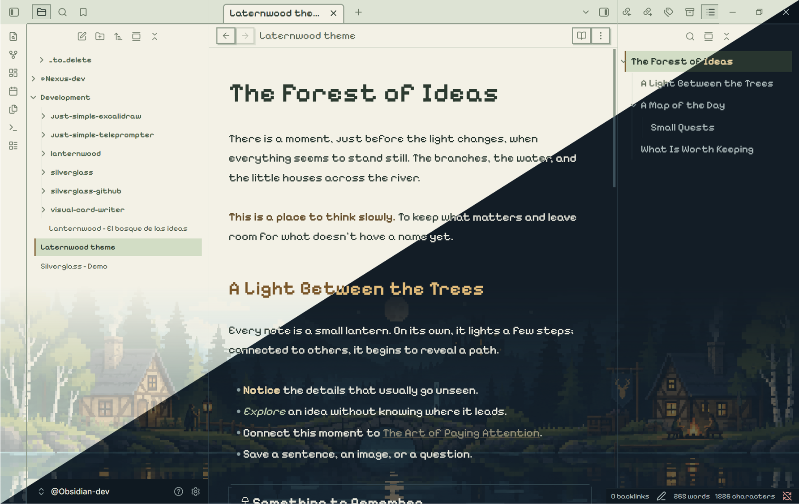
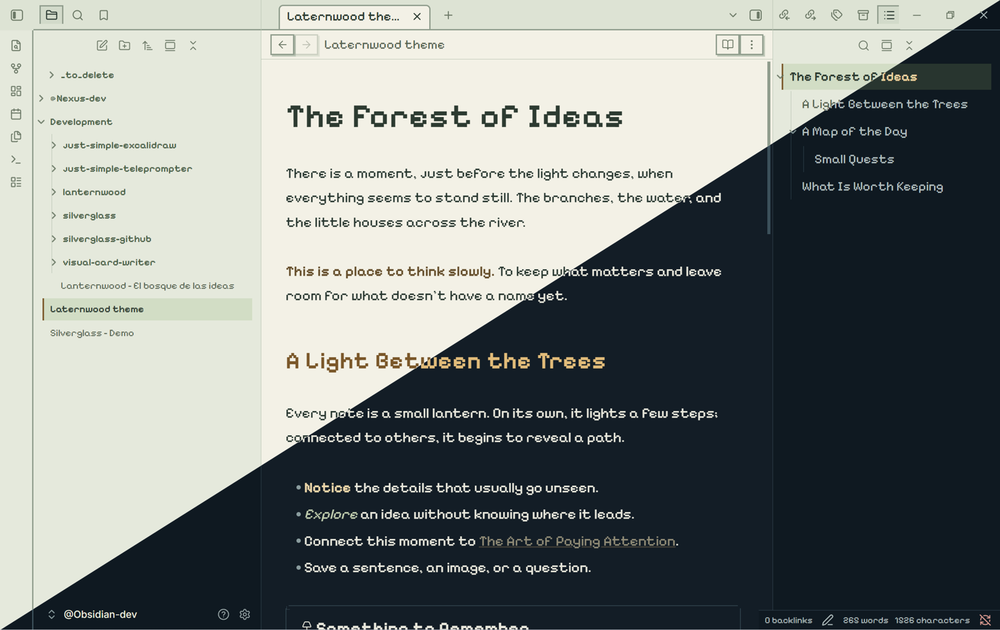
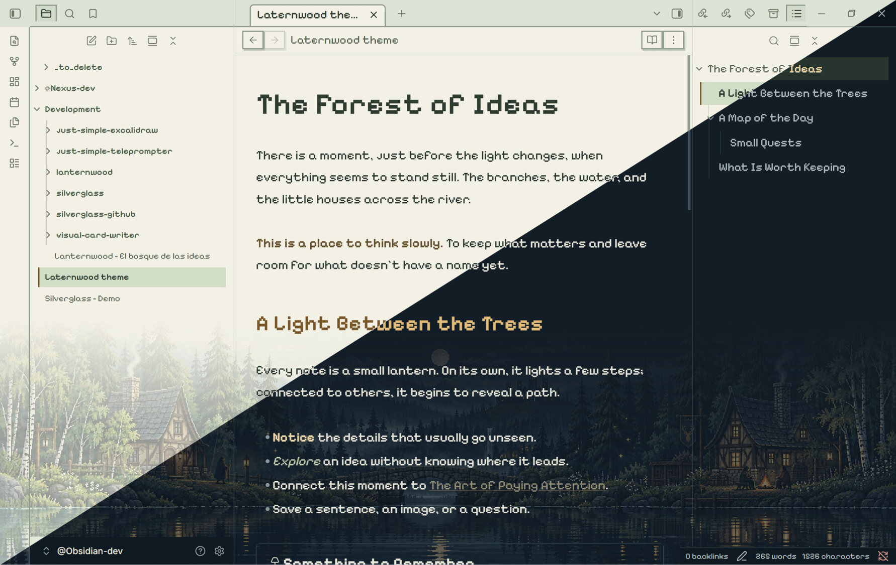

# Lanternwood

A highly customizable pixel-art Obsidian theme with **12 configuration options**
for landscapes, typography, reading width and icons through Style Settings.
Warm lanterns, forest greens and stepped details create a quiet place to write.
Version **0.4.2**. Original theme by David Hurtado.

Inspired by the atmosphere of **Kingdom Two Crowns**, with original scenery and
no extracted game assets. Choose a simple pixel interface, a chunky classic
forest, or a more detailed landscape — all in light and dark mode.

[Download the latest release](https://github.com/DavidHurtadoAI/lanternwood/releases/latest)
· [Configuration](#style-settings) · [Typography](#typography)

## Six looks, one theme

The opening screenshot shows **Classic forest**, with larger pixel clusters and
simpler silhouettes. Light mode is on the upper-left side of each comparison;
dark mode is on the lower-right. These are user-supplied captures of Obsidian.

### Pixel interface, no forest



Turn **Enable forest** off for a clean background. The pixel typography,
square controls and theme colors remain.

### Detailed forest



Enable the forest and select **Detailed — more detail** for finer textures.
For the chunky artwork shown at the top, select **Classic pixel — less detail**.
These three backgrounds × two color schemes make the six looks shown here.

All three screenshots use optional pixel note text. On a fresh install, note
paragraphs keep your reading font and the forest is off.

## Install

In Obsidian, open **Settings → Appearance → Themes → Manage**, search for
**Lanternwood**, then install and use it.

For manual installation:

1. Download [Lanternwood-0.4.2.zip](https://github.com/DavidHurtadoAI/lanternwood/releases/download/0.4.2/Lanternwood-0.4.2.zip) from the release. Extract and copy its `Lanternwood` folder into your vault's
   `.obsidian/themes/` directory. It contains `manifest.json` and `theme.css`.
2. Select **Lanternwood** under **Settings → Appearance → Themes**.
3. Install and enable **Style Settings** if you want to customize the theme.
4. Open **Settings → Style Settings → Lanternwood → Forest → Enable forest**.

Alternatively, download `manifest.json` and `theme.css` from the same release
and place both in `.obsidian/themes/Lanternwood/`. Version **0.2.3** removed the
installation version restriction and no longer requires Obsidian Early Access.
For manual updates, replace those two files with the files from the newer release.

The forest is off by default in a fresh install. The pixel theme works without
Style Settings. Font, original glyphs and all four landscapes are embedded in CSS:
no external asset folders, internet connection, font installation or API key
are needed at runtime. The complete CSS remains below 1 MB. The four landscapes use compressed
WebP at their original 2172×724 dimensions; the original PNGs remain in the repository.
WebP compression is lossy. The build is checked against a 1 MB project budget.

## Day and night

Choose **Landscape style** in Style Settings:

- **Classic pixel — less detail** (default): large pixel clusters, simpler silhouettes,
  fewer fine textures and broader reflections, guided by the supplied Kingdom Two Crowns reference.
- **Detailed — more detail**: the original finer-textured forest artwork.

Each style has its own matching day/night pair. This selection changes the artwork,
not the typography, opacity, forest height or editor layout.

**Dark mode:** midnight blue, sage green and amber, with illuminated cottages
and a moonlit forest. **Light mode:** pale parchment, moss green and warm brown,
with the corresponding daytime landscape. The correct image follows Obsidian's
light/dark setting automatically.

The forest sits **behind the workspace**, with adjustable transparency and a
soft vertical fade. It never reserves space or intercepts clicks: notes retain
the full editor height with the forest on or off. Menus and toolbars retain
their surfaces. The panorama preserves its proportions and crops to fit; its
visible area changes with the window size and chosen background height. It is static.

## Style Settings

Open **Settings → Style Settings → Lanternwood**. There are **12 controls in
two groups**. All option labels and descriptions are in English, regardless of
Obsidian's interface language. Changes apply immediately.

**The tables give fresh-install defaults.** Your saved preferences can differ.
Use the reset arrow next to a modified control to return it to its default.

### Forest

| Control | Default | Available values | What it does |
| --- | --- | --- | --- |
| **Enable forest** | Off | On / Off | Shows the landscape behind the editor and sidebars. Also adds a forest toggle to the command palette. Disabling it leaves the rest of the pixel theme active. |
| **Landscape style** | Classic pixel — less detail | Classic pixel — less detail / Detailed — more detail | Chooses simpler shapes and larger pixel clusters, or the finer-textured original artwork. Both include matching day and night images. Only the scenery changes. |
| **Background height** | 360 px | 100–600 px, in steps of 10 | Sets how far the backdrop rises from the bottom of the workspace. Its top fades into the background. This does not reserve space or shorten the editor. |
| **Forest opacity** | 0.4 | 0.1–0.8, in steps of 0.05 | Controls transparency: lower values blend the scenery more gently into the workspace; higher values make it more visible behind the text. |
| **Forest brightness** | 1 | 0.5–1.2, in steps of 0.05 | Adjusts the image's brightness: 1 keeps the original brightness, values below 1 darken it and values above 1 brighten it. |

**Opacity and brightness are independent.** Lower opacity for a quieter reading
background; lower brightness when the image itself feels too bright. Height,
style, opacity and brightness become visible when the forest is enabled.

The actual height is limited to **75% of the viewport on desktop**, **65% in
windows up to 800 px wide**, and **60% in mobile mode**. The image keeps its
proportions and may crop as the window changes size. A tall, opaque forest
deliberately reaches farther behind the note, reducing contrast near the bottom.
Light and dark modes use the same control values, with different artwork.

### Typography and reading

| Control | Default | Available values | What it does |
| --- | --- | --- | --- |
| **Pixel font** | Pixelify Sans | Pixelify Sans / Silkscreen | Selects the font everywhere the theme uses pixel typography, including tabs and properties. Applies to paragraphs when pixel note text is enabled. |
| **Use Obsidian fonts everywhere** | Off | On / Off | Disables pixel typography across the whole theme, including tabs and properties. Uses Text font, Interface font and Monospace font from Settings → Appearance. Overrides the other pixel font controls. |
| **Use reading font for headings** | Off | On / Off | Replaces the pixel heading font with the reading font. Applies to note headings, the inline title and callout titles. Leave off for pixel headings. |
| **Use regular interface font for navigation** | Off | On / Off | Uses your regular interface font for the file explorer, outline, view-header title, settings labels, buttons and dropdowns. Leave off for pixel navigation. |
| **Use pixel font for note text** | Off | On / Off | Uses the selected pixel font for note text in editing and reading views, using the font size selected in Settings → Appearance. When off, paragraphs use your Obsidian reading font. |
| **Reading width** | 760 px | 520–1000 px, in steps of 20 | Sets the target readable line width. Requires Obsidian's **Settings → Editor → Readable line length** to be enabled; the available pane width still limits it. |
| **Use native Obsidian icons** | Off | On / Off | Restores native icons in place of the theme's 16 custom pixel glyph designs and their aliases. Icons outside that custom set already retain their native appearance. |

**Use Obsidian fonts everywhere** takes precedence over all other typography
controls. Turn it off to resume your saved pixel font selection. The narrower
heading and navigation switches remain available for mixing pixel and regular
fonts. Property names keep their borderless styling with either font mode.

### Settings provided by Obsidian

The **light/dark color scheme**, your **text font**, **interface font**,
**monospace font** and regular **font size** are configured in Obsidian's
**Appearance** settings. Lanternwood uses those preferences where it does not
explicitly apply pixel typography. Both pixel fonts follow the standard **Font size** setting in editing and reading views. **Readable line length** is an Obsidian Editor setting;
Lanternwood's width slider works with it.

There is no separate day/night switch, animation control or independent sidebar
forest toggle: the landscape follows the color scheme and spans the workspace.

## Typography

**Font update in 0.4.0:** Lanternwood now includes only **Pixelify Sans** and
**Silkscreen**. The other experimental fonts have been removed to keep the
selection focused. If you previously selected a removed font, choose one of
the two remaining options; until then, the theme falls back to Pixelify Sans.

We recommend trying both with your own notes. Pixel typography is optional:
if neither feels comfortable for reading, disable it and use any font available
in Obsidian's standard Appearance settings instead.

### Try the two pixel fonts

Open **Settings → Style Settings → Lanternwood → Typography and reading**.
Leave **Use Obsidian fonts everywhere** off and choose **Pixel font**:

| Font | Character and suggested use |
| --- | --- |
| **Pixelify Sans** (default) | The original Lanternwood look; variable weights 400–700. |
| **Silkscreen** | Bold arcade character and uppercase-shaped letters. Includes regular and bold. Try it in titles and navigation before using it for longer notes. |

The selection applies to pixel headings, navigation, tabs, title/status bars,
modal titles and properties. Enable **Use pixel font for note text** to apply
it to paragraphs too. Text size follows **Settings → Appearance → Font size**,
including when pixel typography is enabled. The separate heading and navigation
switches let you keep your reading or interface font in those areas.

### Use your own fonts throughout the theme

1. In **Style Settings → Lanternwood → Typography and reading**, turn
   **Use Obsidian fonts everywhere** **on**.
2. Open **Settings → Appearance** and choose **Text font** for note text and
   headings, **Interface font** for navigation, tabs, controls and properties,
   and **Monospace font** for code.
3. Adjust the regular **Font size** setting for note text if needed.

This single switch disables pixel typography across the theme, even if
**Use pixel font for note text** is still enabled. It preserves your other
choices, so switching it off restores your pixel setup. The forest, colors,
layout and icon preferences stay independent of the font choice.

Both bundled fonts work offline without installation. Their compact WOFF2
subsets include Latin and Latin Extended characters, Spanish accents and ñ,
combining accents, punctuation, currency and arrows where supported by the
originals. Other scripts use system fallbacks. Internal family names use a
Lanternwood prefix; the selector displays the original font names.

Both use the **SIL Open Font License 1.1**, separately from the theme's MIT
license. Sources and notices are retained; see
[THIRD_PARTY_NOTICES.md](THIRD_PARTY_NOTICES.md). Copyright notices and the OFL
terms are also embedded in the CSS. Sources:
[Pixelify Sans](https://github.com/eifetx/Pixelify-Sans) and
[Silkscreen](https://github.com/googlefonts/silkscreen).

## Markdown

Standard headings, tasks, links, tables, code, tags, quotes, properties and
callouts are styled. Two optional callouts add a lantern or woodland accent:

```md
> [!lantern] Something to remember
> Leave room for new ideas.

> [!forest] A forest of connections
> Good notes open new paths.
```

`[!remember]` is an alias for the lantern callout.

## Development

Requires Node.js and npm. No build step is needed for users installing the ZIP.

```sh
npm ci --ignore-scripts
npm run build
npm run lint
npm run check
```

`npm run optimize:assets` regenerates the bundled WebP images from the original
PNGs using Sharp (quality 75, no resizing). The generated WebP files are committed,
so ordinary builds do not need to recompress them.

`scripts/optimize-fonts.py` regenerates the committed WOFF2 subsets using Python,
FontTools and Brotli. Normal builds use those committed files without Python.

`src/theme.css` is the editable CSS. `scripts/build.mjs` embeds the font,
day/night WebP images, font license and original 16×16 SVG glyphs into `theme.css`.
`npm run install:dev` is a local maintainer helper: it assumes the repository
is at `<vault>/Development/lanternwood` and installs two levels above the
repository. Do not use that helper from an arbitrary clone location. `scripts/check.mjs` checks CSS, YAML settings, version synchronization,
asset completeness and offline packaging. `scripts/ui-qa.mjs` uses the Obsidian
CLI against `@Obsidian-dev`, temporarily changes appearance settings and restores
them; it never modifies note content.

See [VALIDATION.md](VALIDATION.md) for actual coverage and limitations.

## License

Lanternwood is released under the **[MIT License](LICENSE)**.
Copyright © 2026 David Hurtado.

You may use, copy, modify and distribute the theme, including for commercial
purposes, provided you retain the copyright and license notice. The theme is
provided "as is", without warranty. See the full license for its terms.

The two bundled fonts use the **SIL Open Font License 1.1** separately from
the MIT license. Copyright notices and full licenses are embedded in the CSS
and included with release ZIPs. See [THIRD_PARTY_NOTICES.md](THIRD_PARTY_NOTICES.md).

## Attribution

- CSS, controls and pixel glyphs: original, MIT, © 2026 David Hurtado.
- Fonts: SIL Open Font License 1.1; see [third-party notices](THIRD_PARTY_NOTICES.md).
- Original day/night scenery generated with OpenAI's built-in image generation
  tool. Source assets and prompts are included in `assets/`.
- Kingdom Two Crowns is an artistic reference. No game files, screenshots,
  logos, soundtrack or extracted game assets are included. This is an independent
  theme, not an official Kingdom or Obsidian product.

Published releases are available on [GitHub](https://github.com/DavidHurtadoAI/lanternwood/releases).
The theme has not been submitted to the Community Themes directory.
Choose another theme in Appearance to deactivate it.

## Mask compatibility

Pixel icons, checkbox marks and the forest fade include WebKit-prefixed masks for older browser engines. Pixel icon replacement is enabled only when CSS masks are supported; otherwise, the original Obsidian icons remain visible. Without masks, the forest retains its overall transparency but loses the gradient fade. The native icon option remains available in Style Settings.

The browser-feature validator may still flag standard CSS masks against its Obsidian 1.4.5 baseline. The prefixed declarations and feature checks address the fallback behavior; they do not certify every feature of the theme on historical Obsidian versions. The lint configuration allows only the three required WebKit mask properties.
